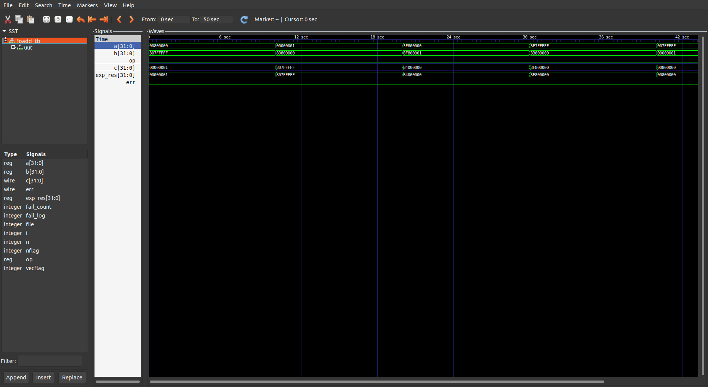

# Variable-Precision Floating-Point Adder


A from-scratch, gate-level implementation of IEEE-754 floating-point addition/subtraction for parameterized bit-widths, in Verilog HDL, built as a learning resource for deep architectural understanding.
## Why This Project Exists?
Most resources on IEEE-754 floating-point addition:
- Explain theory briefly, without diving into some important concepts such as sub-normal handling, rounding, etc.
- Provide implementational code without explaining the underlying architecture.

This project bridges that gap.

It is designed as:
- a **learning resource** for understanding floating-point arithmetic at the hardware level
- a **fully working Verilog implementation** that closely mirrors the actual datapath

## Features
- **Comprehensive Handling:** Accounts for standard normalized numbers as well as sub-normal numbers, `+0`, and `-0`.
- **Synthesizable RTL:** Pure Verilog HDL implementation mapping closely to a real hardware datapath.
- **Custom Testing Tools:** Includes a C-based binary test vector generator (`real2hex`) for rigorous, automated test coverage.

## Get Started
### Pre-Requisites
- [*Icarus Verilog*](https://steveicarus.github.io/iverilog/) (for compiling and running Verilog simulations) & [*GTKWave*](https://gtkwave.sourceforge.net/) (for waveform viewing, optional)
- Advanced EDA tools such as [*Vivado*](https://www.xilinx.com/support/download/index.html/content/xilinx/en/downloadNav/vivado-design-tools.html) and/or [*Quartus*](https://www.intel.com/content/www/us/en/collections/products/fpga/software/downloads.html) (for simulation, synthesis and implementation, optional)

### Repository Cloning 
```bash
git clone https://github.com/ninzzd/fp-adder-verilog.git
cd fp-adder-verilog
```

### Test Vector Generation
Compile *real2hex* binary test vector generator:
```bash
gcc -g tb/real2hex.c -o tb/real2hex.out
```
Run *real2hex*:
```bash
./tb/real2hex.out
```
Follow the below format for providing test vectors as inputs to *real2hex*:
```csv
n <total no. of test vectors>
a1 <operand a of test vector 1>, b1 <operand a of test vector 1>, op1 <0 for add, 1 for sub>
.
.
.
an <operand a of test vector n>, bn <operand a of test vector n>, opn <0 for add, 1 for sub>
```
As a simple example, you may copy the following test vector set and paste in the input terminal of *real2hex*:
```csv
5
1.17549435e-38, -1.17549421e-38, 0
1.40129846e-45, -1.17549435e-38, 0
1.0, -1.00000012, 0
0.99999994, 5.96046448e-08, 0
1.17549421e-38, 1.40129846e-45, 0
```
Press `ENTER`. A file named `test_vectors.csv` will be generated in the working directory.

### Verilog Simulation
Compile the main testbench:
```bash
iverilog -o fpadd_tb.vvp tb/fpadd_tb.v src/*.v src/utils/*.v src/datapath/*.v
```
Run the compiled iverilog simulation:
```bash
vvp fpadd_tb.vvp
```
You should expect the following output:
```text
VCD info: dumpfile fpadd_tb.vcd opened for output.
Running 5 test vectors
PASS: a=00800000 b=807fffff op=0 result=00000001
PASS: a=00000001 b=80800000 op=0 result=807fffff
PASS: a=3f800000 b=bf800001 op=0 result=b4000000
PASS: a=3f7fffff b=33800000 op=0 result=3f800000
PASS: a=007fffff b=00000001 op=0 result=00800000
Simulation complete
```

### Waveform Analysis
To view the digital waveforms of various signals, wires and regs in the verilog simulation, run the following:
```bash
gtkwave fpadd_tb.vcd
```
You should expect the following waveforms:

Double-click on the wire/reg names to view their waveforms.
## Architecture
The hand-drawn diagram below depicts the micro-architectural implementation of the floating-point adder, which directly matches the Verilog hardware description, with some minor differences in nomenclature and naming. This is particularly for the digital design enthusiasts and architectural thinkers out there :)


## File Hierarchy
```text
├── src/                # Source files (.v)
│   ├── datapath/       # Specific to this project, build the datapath
│   ├── utils/          # Modules for general circuits (add, mux, inc, etc.)
│   └── fpadd.v         # Main module source file (.v)
├── tb/                 # Test-bench files (.v)
│   ├── datapath_tb/    # Test-benches for datapath-specific modules
│   ├── utils_tb/       # Test-benches for general modules
│   └── fpadd_tb.v      # Main test-bench file (.v)
├── docs/               # Technical documentation and diagrams
│   # ├── README.md     # Documentation (does not exist yet)
│   └── logs/           # Waveform images and logs of test runs
└── README.md           # You are here
```

## Documentation
Given below are the major components of the floating-point adder and their corresponding documentation links:
- [Nomenclature](./docs/nomenclature.md)
- [Exponent Comparator](./docs/exponent_comparator.md)
- [Mantissa Alignment](./docs/mantissa_alignment.md)
- [Mantissa Adder Operation Logic and Output Sign](./docs/manop_outsign.md)
- [Leading Zero Detector](./docs/leading_zero_detector.md)
<!-- - [Normalization](./docs/normalization.md) -->
- [Rounding](./docs/rounding.md)

Refer to [this page](./docs/theory.md) for detailed documentation on floating-point adder theory.

## Testing

| Precision | $le$ | $lm$ | $N_{samples}$ | $N_{fail}$ | Accuracy | Execution Time |
| --- | --- | --- | --- | --- | --- | --- | 
| fp32 | 8 | 23 | 200000 | 0 | 100% | 35m 29s | 

## RoadMap

### V1.0 - Functional Correctness
- [x] Handles additions/subtractions of normalized numbers.
- [x] Accounts for sub-normal numbers.
- [x] Handles +0, -0
- [x] Handles $+\infty$, $-\infty$
- [x] Handles NaN propagation

### V1.1 - Verification & Characterization (unpipelined)
- [ ] Promote corner cases from [`running_doc.md`](./docs/logs/running_doc.md) into a permanent regression suite
- [ ] Cross-validate against a reference oracle (e.g. SoftFloat) using `real2hex` vectors
- [ ] STA/critical-path analysis on the unpipelined datapath, baseline Fmax
- [ ] FPGA prototyping: resource utilization + baseline Fmax
- [ ] Benchmark Fmax, critical-path delay, and power/energy across bit-width configs (`le`, `lm`) relevant to ML inference: binary32 (`le=8, lm=23`), binary16 (`le=5, lm=10`), bfloat16 (`le=8, lm=7`), FP8 E4M3 (`le=4, lm=3`), FP8 E5M2 (`le=5, lm=2`)

### V2.0 - Pipelining & Performance
- [ ] Pipelining, with stage boundaries chosen from the V1.1 critical-path breakdown
- [ ] Re-run FPGA prototyping post-pipelining: resource utilization + Fmax delta vs. V1.1 baseline (same bit-width configs)
- [ ] Fmax estimation for the pipelined architecture vs. the V1.1 unpipelined baseline

## License
This project is open-source and available under the terms of the [MIT License](LICENSE).